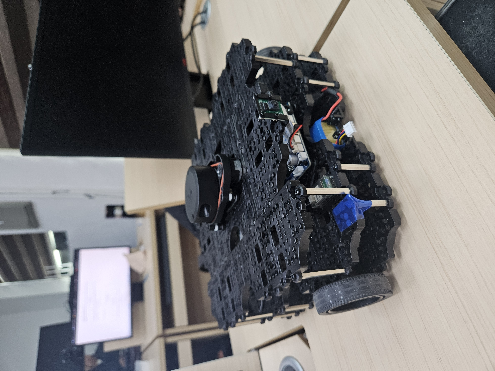
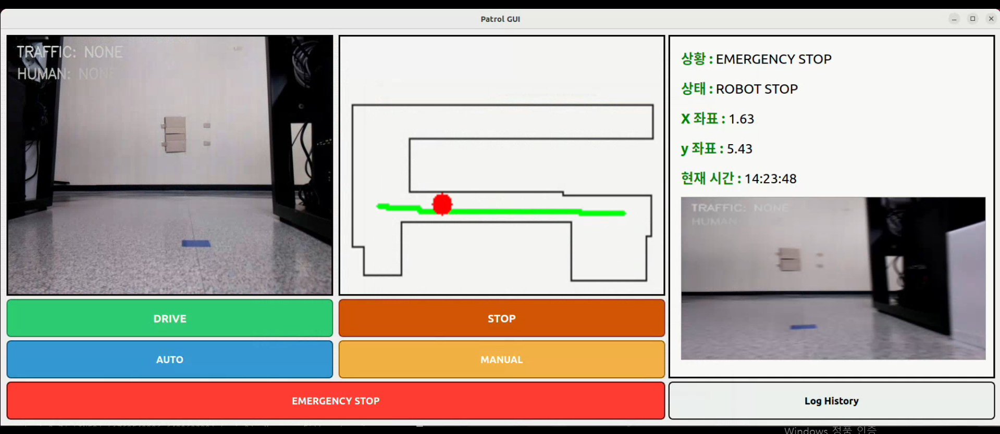
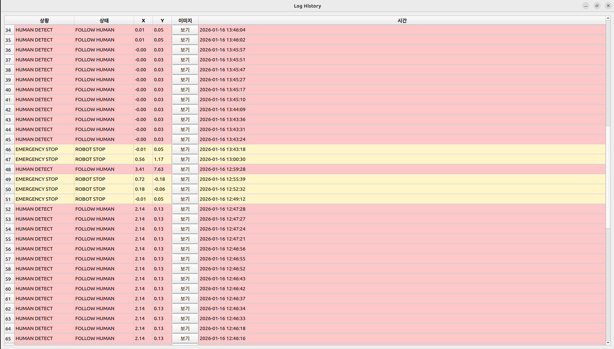

<h1>🚓 Patrol Robot</h1>

 




- --
**## 🎈 주요 기능**

**### 1️⃣ 경로 기반 자율 주행 및 장애물 감지 자율 주행**
- SLAM 기반 지도 생성
- 사전 정의된 웨이포인트를 따른 경로 반복 주행
- OccupancyGrid 기반 A* 전역 경로 계획
- LiDAR 센서 값을 받아 실시간 장애물 감지
- 장애물 감지 시 정지 또는 회피 기동


**### 2️⃣ 객체 인식**
- YOLO을 이용하여 신호등 객체 인식
- 인식 결과에 따른 주행 제어

  
**### 3️⃣ 머신러닝 기반 객체 판별**
- YOLO 탐지 결과 특징 추출
- 머신러닝 이진 분류 모델을 사용하여 신체의 50% 이상이 검출 될 시 사람이라고 판별
- 추론 결과에 따른 주행 제어


**### 4️⃣ 사람 추종 주행**
- 머신러닝 결과를 참조하여 사람 객체 인식
- 사람 인식 시 사람 추종 주행
- 추종 중 장애물 감지 시 정지 또는 회피 기동


**### 5️⃣ MinIO 스토리지 업로드 및 확인**
- 객체 인식 시 이미지 자동 캡처
- MinIO Object Storage로 이미지 업로드
- 웹 UI를 통하여 저장 이미지 확인 가능
- 상황 발생 시 이미지 기록 및 관리


**### 6️⃣ SQL 데이터베이스 연동**
- 객체 인식 및 이벤트 발생 정보 DB 저장
- 시간, 위치 등 로그 관리
- 로그 히스토리 저장 


**### 7️⃣ 비상 정지 및 상태 제어**
- GUI 연동, 비상 정지 버튼 클릭 시 비상 정지
- 비상 정지 상태 유지 및 해제 후 주행 재개


**### 8️⃣ 자동 / 수동 모드 전환 및 주행 재개**
- 자동 모드와 수동 모드 전환
- 자동 모드 주행 시 수행 모드 전환 불가, 정지 상태에서만 전환 가능
- 현재 위치 추정 및 재개 버튼 클릭 시 자동 주행 반복 


**### 9️⃣ 로그 히스토리 관리**
- 주행 상태, 객체 인식, 이벤트 로그 기록
- DB 기반 로그 히스토리 저장


- --
**## 🗂️ 패키지 구조**

```
turtle_pkg/
├── patrol_robot/
│   ├── data_ml.py
│   ├── image_debug.py
│   ├── location.py
│   ├── patrol_robot.py
│   ├── person_detect.py
│   ├── yolo_human.py
│   └── yolo_light.py
│   └── gui.py
├── launch/
│   └── execute_patrol_robot.launch.py
│   └── slam_local.launch.py
├── config/
│   ├── patrol_waypoints.yaml
│   └── person_dataset.csv
│   └── person_gate_model.joblib
└── README.md

```

- --

**## 🚀 실행 방법**

```bash

ros2 launch turtle_pkg execute_patrol_robot.launch.py

```

- --

## ⚙️ 주요 토픽

| 토픽 | 타입 | 설명 |
|------|------|------|
| `/cmd_vel` | geometry_msgs/Twist | 로봇 속도 제어 |
| `/map` | nav_msgs/OccupancyGrid | 지도 데이터 |
| `/global_path` | nav_msgs/Path | 전역 경로 |
| `/patrol_start` | std_msgs/Bool | 주행 시작 |
| `/patrol_stop` | std_msgs/Bool | 비상 정지 |

- --

**## 🛠️ 개발 환경**

- Ubuntu 22.04
- ROS 2 Humble
- Python 3.9 / C++
- Gazebo, RViz2
- YOLO8v
- --
